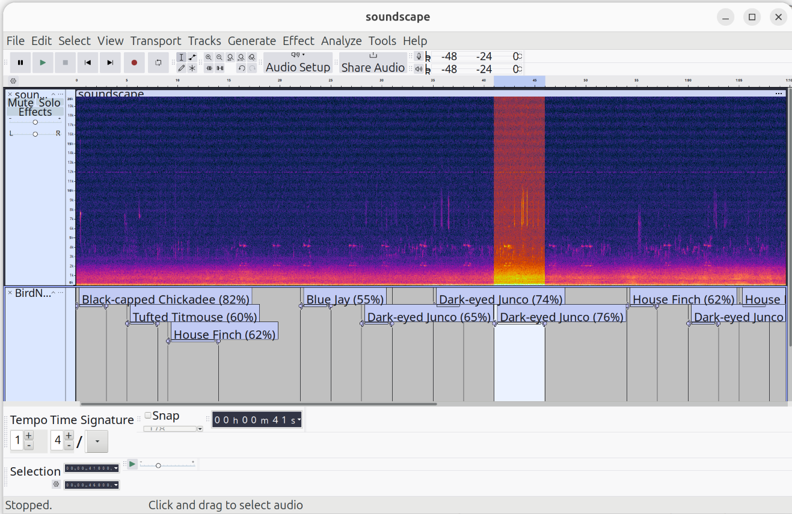

# 🎶 🐦‍⬛ BirdNet VAMP Plugin for Audacity

[](https://opensource.org/licenses/MIT)
[](https://www.python.org/downloads/)
[](https://www.audacityteam.org/)
[](https://isocpp.org/)

A VAMP plugin for Audacity that runs [BirdNET v2.4](https://github.com/birdnet-team/birdnet) inference to automatically detect and label bird vocalizations in audio recordings.

Detections appear as labeled regions directly on the Audacity track, with the species name and confidence score. Consecutive or overlapping detections of the same species are automatically merged into a single label.



---

## Features

- Automatic bird species detection using BirdNET v2.4 (TensorFlow backend)
- Labels appear directly on the Audacity track with species name and confidence score
- Nine configurable parameters via Audacity's plugin interface:
  - **Confidence Threshold** — minimum confidence score to report a detection (default: 0.25)
  - **Top K Species** — maximum number of species candidates per segment (default: 10)
  - **Stride (s)** — sliding window step size in seconds (default: 3.0)
  - **High-pass cutoff frequency** — minimum frequency for bandpass filter in Hz (default: 0)
  - **Low-pass cutoff frequency** — maximum frequency for bandpass filter in Hz (default: 15000)
  - **Latitude** — latitude for geographic species filtering; 0.0 = disabled (default: 0.0)
  - **Longitude** — longitude for geographic species filtering; 0.0 = disabled (default: 0.0)
  - **Week of the Year** — week number (1–52) for seasonal filtering; 0 = disabled (default: 0)
  - **Geographic Model Confidence** — minimum confidence for the geographic model filter (default: 0.03)
- Works on full recordings or selected segments
- Consecutive and overlapping detections of the same species are merged automatically
- Optional geographic and seasonal filtering using BirdNET's built-in geo model

---

## Requirements

- Ubuntu 22.04 with internet connection 
- [Miniconda](https://docs.conda.io/en/latest/miniconda.html) installed at `~/miniconda3`
- `cmake`, `g++`, and `vamp-plugin-sdk` (installed automatically by `install.sh` script)

---

## Installation

### 1. Clone the repository

```bash
git clone https://github.com/juancolonna/birdnet-vamp-plugin.git
cd birdnet-vamp
```

### 2. Run the installation script

```bash
bash install.sh
```

The script will automatically:
- Downloads the Audacity 3.7.7 AppImage if not already present and verifies its integrity via SHA256 checksum.
- Install system build dependencies (`cmake`, `g++`, `vamp-plugin-sdk`)
- Create a Conda environment named `birdnet-plugin` with Python 3.12
- Install the `birdnet` Python package inside the Conda environment
- Compile the VAMP plugin into the `build/` directory
- Copy `birdnet_run.py` into `build/` alongside the plugin
- Create a desktop shortcut named **Audacity-BirdNet** in your application menu

> **Note:** The installation does not modify or remove any existing Audacity installation on your system. The bundled AppImage runs independently.

---

## Running

### From the application menu

After installation, open **Audacity-BirdNet** from your application menu. The shortcut automatically sets `VAMP_PATH` to the correct directory.

### From the terminal

```bash
VAMP_PATH=$PWD/build ./audacity-linux-3.7.7-x64-22.04.AppImage
```

> Run this command from inside the cloned repository directory.

## Usage

1. Open an audio file in Audacity (**File → Open**)
2. Optionally select a specific region of the track to analyze
3. Go to **Analyze → BirdNET**
4. Adjust parameters if desired
5. Click **OK** and wait for the analysis to complete
6. Detections appear as labeled regions on a new label track

> **Tip:** The output label track can be exported via **File → Export → Export Labels** for further analysis.

> **Note:** Stereo audio files are automatically mixed down to mono by averaging both channels, which may produce slightly different results compared to a native mono recording. If you are unsure, convert your audio to mono before running **Analyze → BirdNET**.

⚠️ **Important note:** The plugin processes only a single audio track at a time. Multitrack projects are not supported, running the plugin with multiple tracks, even if only one is selected, will produce incorrect or incomplete results. This is an Audacity bug processing when processing VAMP plugins.

---

## Output format

Each label on the track follows the format:

```
Species Name (XX%)
```

For example:
```
Black-capped Chickadee (82%)
House Finch (61%)
```

Where `XX%` is the average confidence score across all merged segments.

### Exporting generated labels

After running the plugin, a new 'BirdNet' track with labels will appear. It can be directly exported for further use. Go to **File → Export Other → Export Labels**; it will produce a file in this format:

``` 
0.000000	3.000000	Black-capped Chickadee (82%)
9.000000	12.000000	House Finch (65%)
42.000000	45.000000	Dark-eyed Junco (73%)
54.000000	57.000000	House Finch (62%)
60.000000	63.000000	Dark-eyed Junco (56%)
72.000000	75.000000	House Finch (60%)
```

---

## Project structure

```
birdnet-vamp-plugin/
├── BirdNetPlugin.cpp                          # VAMP plugin implementation (C++)
├── BirdNetPlugin.h                            # VAMP plugin header
├── birdnet_run.py                             # BirdNET inference script (Python)
├── CMakeLists.txt                             # Build configuration
├── install.sh                                 # Installation script
├── audacity-linux-3.7.7-x64-22.04.AppImage   # Bundled Audacity AppImage
└── build/                                     # Compiled plugin (created by install.sh)
    ├── birdnet-vamp.so                        # Compiled VAMP plugin
    └── birdnet_run.py                         # Copy of the inference script
```

---

## How it works

1. When **Analyze → BirdNET** is triggered, the VAMP plugin accumulates all audio samples into a buffer
2. At the end of the stream, it writes the buffer to a temporary WAV file
3. It invokes `birdnet_run.py` as a subprocess using the Python interpreter from the `birdnet-plugin` Conda environment
4. The Python script runs BirdNET v2.4 inference and returns detections as a JSON array via stdout
5. Consecutive or overlapping detections of the same species are merged into single labels
6. The plugin reads the JSON, creates VAMP features, and displays them as labeled regions in Audacity
7. The temporary WAV file is deleted after processing

---

## Geographic and Seasonal Filtering

When Latitude 'and' Longitude are set to non-zero values, the plugin activates BirdNET's geographic model to filter the species list before running acoustic inference. This restricts detections to species that are realistically expected at the given location, significantly reducing false positives. Optionally, setting Week of the Year (1–52) further narrows the filter to species expected at that location during that season. For example, a migratory species present only in summer will be excluded outside its expected seasonal window.

The Geographic Model Confidence parameter controls how broadly the geo model selects candidate species. Lower values (e.g., 0.01) include more species in the filter; higher values (e.g., 0.1) apply a stricter regional filter.

> **Note:** Geographic filtering has no effect if both Latitude and Longitude are left at 0.0.

---

## Troubleshooting

**Plugin does not appear in Analyze menu**
- Make sure `VAMP_PATH` points to the `build/` directory
- Re-run `bash install.sh` to recompile and reconfigure

**No detections produced**
- Try lowering the **Confidence Threshold** (e.g., 0.1)
- Make sure the audio contains bird vocalizations
- Check that the Conda environment is correctly installed: `conda activate birdnet-plugin && python3 -c "import birdnet; print('OK')"`

**Audacity shows "not responding" during analysis**
- This is expected — BirdNET inference with TensorFlow can take 10–30 seconds depending on audio length
- Click **Wait** and the analysis will complete normally

---

## Citation

If you use this plugin in your research, please cite:

```bibtex
@software{colonna2024birdnet_vamp,
  author  = {Colonna, Juan G.},
  title   = {BirdNET VAMP Plugin for Audacity},
  year    = {2024},
  url     = {https://github.com/juancolonna/birdnet-vamp-plugin}
}
```

---

## License and Author

MIT License — see [LICENSE](LICENSE) for details.

**Prof. Dr. Juan G. Colonna, IComp,UFAM** — [github.com/juancolonna](https://github.com/juancolonna)
