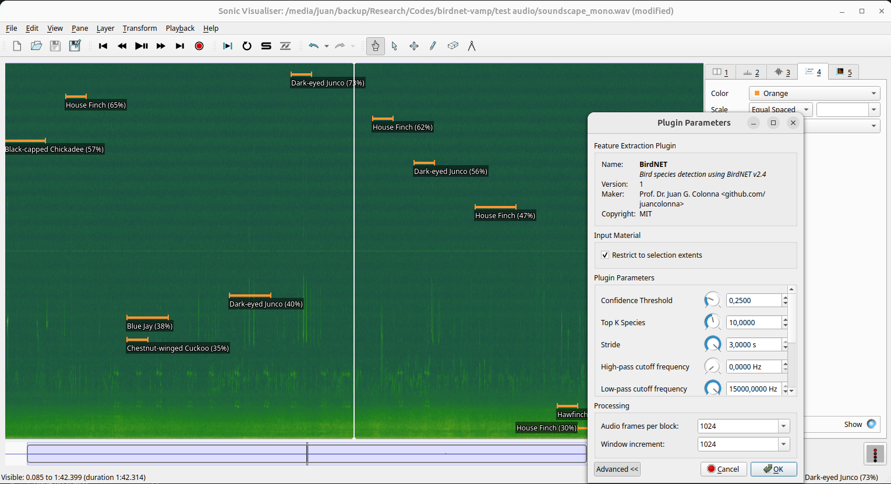

# 🎶 🐦‍⬛ BirdNET VAMP Plugin for Audacity and Sonic-Visualiser

[](https://opensource.org/licenses/MIT)
[](https://www.python.org/downloads/)
[](https://isocpp.org/)
[](https://www.audacityteam.org/)
[](https://www.sonicvisualiser.org/)

A VAMP plugin for [Audacity](https://www.audacityteam.org/) and/or [Sonic-Visualiser](https://sonicvisualiser.org/) that runs [BirdNET v2.4](https://github.com/birdnet-team/birdnet) inference (using the `birdnet` Python package, compatible with BirdNET v2.4) to automatically detect and label bird vocalizations in audio recordings.

Detections appear as labeled regions directly on the label track (Audacity) or as an annotation layer (Sonic-Visualiser), with the species name and confidence score. Consecutive or overlapping detections of the same species are automatically merged into a single label.

### How it looks in Audacity


### How it looks in Sonic-Visualiser


> ⚠️ **Important:** This repository includes a compiled fork of Audacity 3.7.7 with a VAMP plugin bug fix for proper multi-track support (bug fixed by me 😉). To work correctly, run it with **Audacity-VampFix-3.7.7-x86_64.AppImage**.

## Features

- Automatic bird species detection using BirdNET v2.4 (TensorFlow backend)
- Labels appear as a label track or annotation layer with species name and confidence score
- Nine configurable parameters via the VAMP plugin interface:
  - **Confidence Threshold** — minimum confidence score to report a detection (default: 25%, interval [1:99])
  - **Top K Species** — maximum number of species candidates per segment (default: 10)
  - **Stride (s)** — sliding window step size in seconds (default: 3.0)
  - **High-pass cutoff frequency** — minimum frequency for the bandpass filter in Hz (default: 0)
  - **Low-pass cutoff frequency** — maximum frequency for the bandpass filter in Hz (default: 15000)
  - **Latitude** — latitude for geographic species filtering; 90.0 or -90.0 = disabled (default: 90.0)
  - **Longitude** — longitude for geographic species filtering (default: 0.0)
  - **Week of the Year** — week number (1–52) for seasonal filtering; 0 = disabled (default: 0)
  - **Geographic Model Confidence** — minimum confidence for the geographic model filter (default: 3.0%, interval [1:99])

- Works on full recordings or selected segments
- Consecutive and overlapping detections of the same species are merged automatically
- Optional geographic and seasonal filtering using BirdNET's built-in geo model

## Requirements

- Ubuntu 22.04 with an internet connection 
- [uv](https://github.com/astral-sh/uv) (an extremely fast Python package and project manager, written in Rust)
- `cmake`, `g++`, and `vamp-plugin-sdk` (installed automatically by `install.sh` script)
- `curl`

## Installation

- Create a `vamp` folder in your home directory.
- Download the `birdnet-vamp-linux_x86_64.zip` file and unzip it.
- Copy the three extracted files: `birdnet-vamp-linux_x86_64.so`, `birdnet_run.py`, and `birdnet_labels.csv` into the `vamp` folder.
- Install `uv` to create the virtual environment.
- Download and run either the Audacity AppImage or the Sonic Visualiser AppImage.

## Running

### From the terminal

Run this command:

```bash
VAMP_PATH=$HOME/vamp ./Audacity-VampFix-3.7.7-x86_64.AppImage
```
or
```bash
VAMP_PATH=$HOME/vamp ./SonicVisualiser-5.2.1-x86_64.AppImage
```

## Usage on Audacity

1. Open an audio file in Audacity-BirdNET (**File → Open**)
2. Optionally select a specific region of the track to analyze
3. Go to **Analyze → BirdNET**
4. Adjust parameters if desired
5. Click **OK** and wait for the analysis to complete
6. Detections appear as labeled regions on a new label track

> **Note:** Stereo audio files are automatically mixed down to mono by averaging both channels when you execute the BirdNET plugin, which may produce slightly different results compared to a native mono recording. If you are unsure, convert your audio to mono before running **Analyze → BirdNET**.

## Usage on Sonic-Visualiser

1. Open an audio file in Sonic-BirdNET (**File → Open**)
2. Optionally select a specific region of the track to analyze
3. Go to **Transform → Analysis by Plugin Name → BirdNET**
4. Adjust parameters if desired
5. Click **OK** and wait for the analysis to complete
6. Detections appear as labeled regions on a new label layer

## Annotation format

Each label on the track follows the format:

```
Scientific Name (XX%)
```

For example:
```
Poecile atricapillus (56%)
Haemorhous mexicanus (65%)
...
```

Where `XX%` is the average confidence score across all merged segments.

> **Tip:** The output labels can be exported in CSV format via **File → Export Other → Export Labels** in Audacity, or via **File → Export Annotation Layer** in Sonic Visualiser, for further analysis.

## How it works

1. When **BirdNET** is triggered, the VAMP plugin accumulates all audio samples into a buffer
2. At the end of the stream, it writes the buffer to a temporary WAV file
3. It invokes `birdnet_run.py` as a subprocess using the Python interpreter from the `uv` virtual environment
4. The Python script runs BirdNET v2.4 inference and returns detections as a JSON array via stdout
5. Consecutive or overlapping detections of the same species are merged into single labels
6. The plugin reads the JSON, creates VAMP features, and displays them as labeled regions in Audacity or Sonic-Visualiser
7. The temporary WAV file is deleted after processing

## Geographic and Seasonal Filtering

When Latitude 'and' Longitude are set to non-zero values, the plugin activates BirdNET's geographic model to filter the species list before running acoustic inference. This restricts detections to species that are realistically expected at the given location, significantly reducing false positives. Optionally, setting Week of the Year (1–52) further narrows the filter to species expected at that location during that season. For example, a migratory species present only in summer will be excluded outside its expected seasonal window.

The Geographic Model Confidence parameter controls how broadly the geo model selects candidate species. Lower values (e.g., 1%) include more species in the filter; higher values (e.g., 10%) apply a stricter regional filter.

> **Note:** Geographic filtering has no effect if any, Latitude or Longitude, are left at 0.0.

## Troubleshooting

**Plugin does not appear in Analyze menu**
- Make sure `VAMP_PATH` points to the `vamp/` directory

**No detections produced**
- Try lowering the **Confidence Threshold** (e.g., 10%, interval 0%-99%)
- Make sure the audio contains bird vocalizations
- Check that the `uv` is correctly installed: `curl -LsSf https://astral.sh/uv/install.sh | sh`

**Audacity shows "not responding" during analysis**
- This is expected — BirdNET inference with TensorFlow can take 10–30 seconds depending on audio length
- Click **Wait** and the analysis will complete normally

**Plugin fails to run or does not appear to start analysis**
- Run Audacity or Sonic Visualiser from the terminal to see the plugin error output.
- If you see `Unsupported VAMP block configuration`, the host configuration is not compatible with this plugin. The plugin currently requires `stepSize` and `blockSize` to be equal (`stepSize == blockSize`).

## Citation

If you use this plugin in your research, please cite:

```bibtex
@software{colonna2026birdnet_vamp,
  author  = {Colonna, Juan G.},
  title   = {BirdNET VAMP Plugin for Audacity and Sonic-Visualiser},
  year    = {2026},
  url     = {https://github.com/juancolonna/birdnet-vamp-plugin}
}
```

## License and Author

MIT License — see [LICENSE](LICENSE) for details.

**Prof. Dr. Juan G. Colonna, IComp,UFAM** — [github.com/juancolonna](https://github.com/juancolonna)
